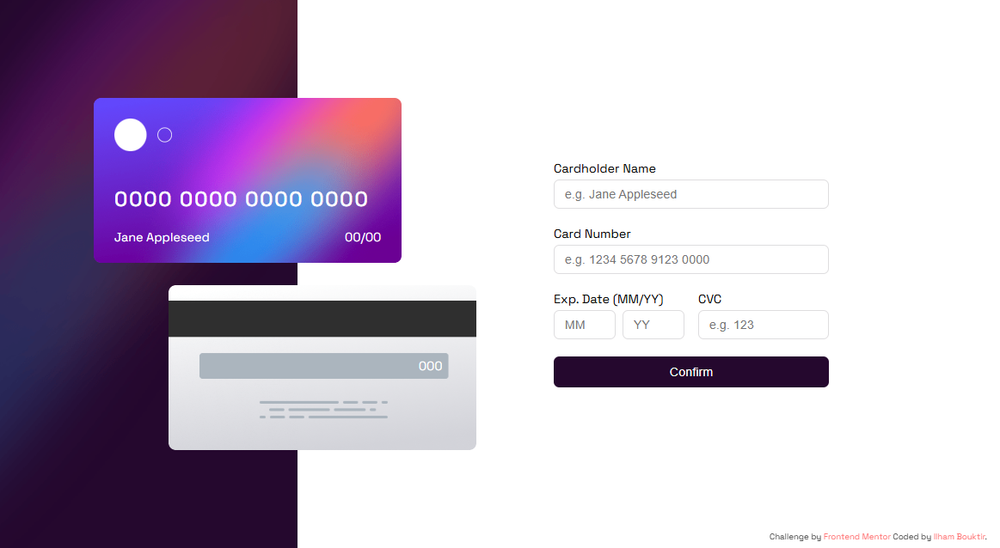

# Frontend Mentor - Interactive card details form solution

This is a solution to the [Interactive card details form challenge on Frontend Mentor](https://www.frontendmentor.io/challenges/interactive-card-details-form-XpS8cKZDWw). Frontend Mentor challenges help improve coding skills by building realistic projects. 

## Table of contents

- [Overview](#overview)
  - [The challenge](#the-challenge)
  - [Screenshot](#screenshot)
  - [Links](#links)
- [My process](#my-process)
  - [Built with](#built-with)
  - [What I learned](#what-i-learned)
  - [Continued development](#continued-development)
  - [Useful resources](#useful-resources)
- [Author](#author)
- [Acknowledgments](#acknowledgments)

## Overview

### The challenge

Users should be able to:

- Fill in the form and see the card details update in real-time
- Receive error messages when the form is submitted if:
  - Any input field is empty
  - The card number, expiry date, or CVC fields are in the wrong format
- View the optimal layout depending on their device's screen size
- See hover, active, and focus states for interactive elements on the page

### Screenshot



### Links

- Solution URL: [Solution](https://www.frontendmentor.io/solutions/responsive-interactive-card-details-form-solution-A3c9fyybKR)
- Live Site URL: [Live site](https://ilham-bouk.github.io/Interactive_card_details_form/)

## My process

### Built with

- Semantic HTML5 markup
- CSS custom properties
- JavaScript 
- Flexbox
- Desktop-first workflow
- Regular expression

### What I learned 

This challenge provided valuable practice for my coding skills, particularly in styling images, validation and regular expression and some semantic elements. 

```html
<figure class="cards">
  <figcaption class="bg-front">
         ... 
  </figcaption>
  <figcaption class="bg-back">
         ... 
  </figcaption>
</figure> 
```

``` css
.detail .form label input:hover,
.detail .form label input:focus {
  background-image: linear-gradient(white, white), linear-gradient(to right, var(--Linear-gradient));
  border: 2px solid transparent;
  background-origin: border-box;
  background-clip: padding-box, border-box;
} 
```

```js
function formatNumber(cardNumber) {
  let str = String(cardNumber);
  return str.replace(/(\d{4})/g, '$1 ').trim();
}
```


### Continued development


### Useful resources

 - [Regular expressions](https://developer.mozilla.org/en-US/docs/Web/JavaScript/Guide/Regular_expressions) Thise article help me to review the essentials of JavaScript regular expressions, covering syntax, patterns, and practical examples. 
 - [RegExr](https://regexr.com/) An online tool to learn, build, & test Regular Expressions.

## Author

- Frontend Mentor - [@ilham-bouk](https://www.frontendmentor.io/profile/ilham-bouk)
- LinkedIn - [Ilham Bouktir](https://www.linkedin.com/in/ilham-bouktir-0b266b31b)

## Acknowledgments

A big thank you to anyone providing feedback on [my solution](https://www.frontendmentor.io/solutions/responsive-interactive-card-details-form-solution-A3c9fyybKR). It definitely helps to find new ways to code and find easier solutions!

**Happy coding!** ☺️🚀
